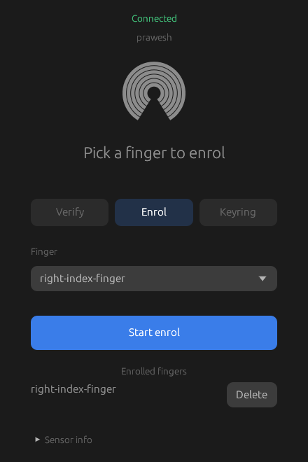
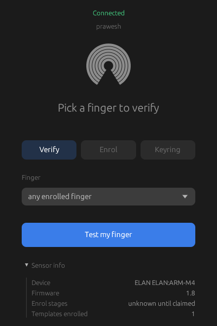
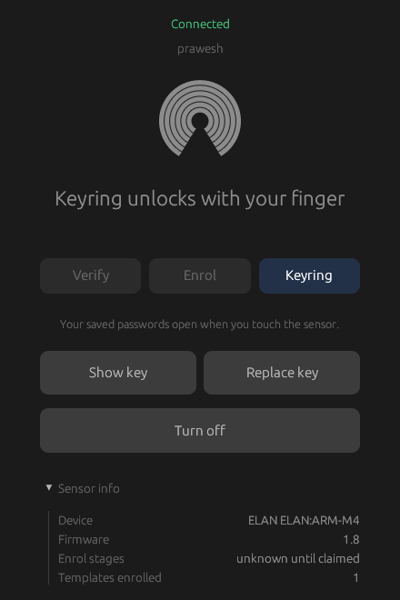
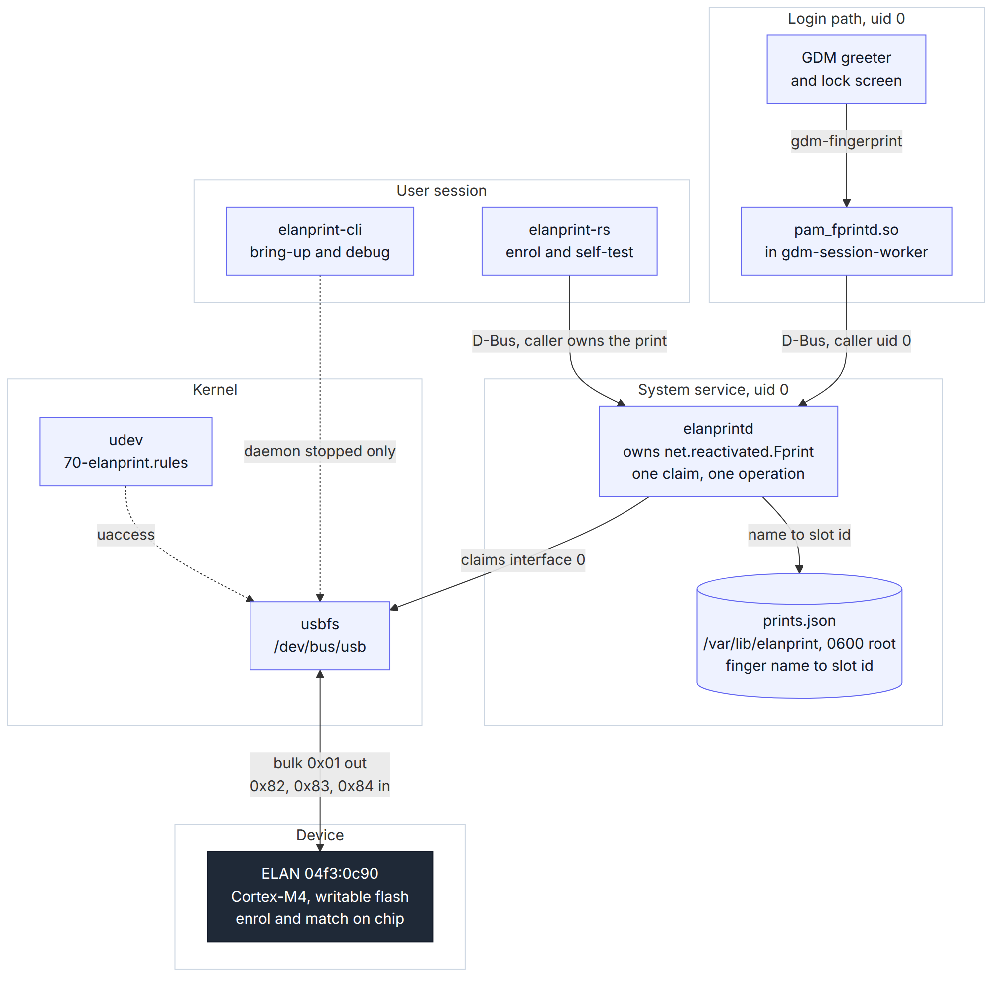
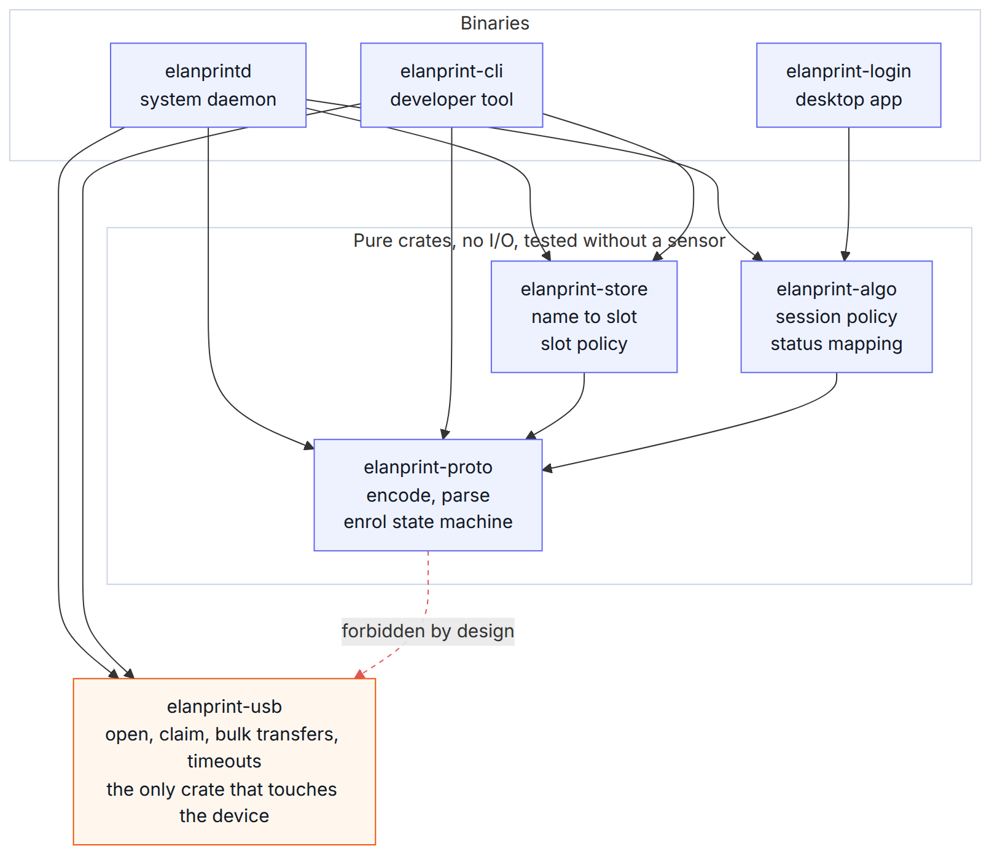
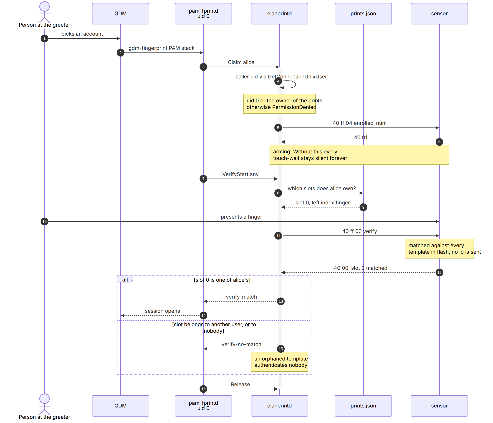

# elanprint-rs

A userspace driver for the ELAN `04f3:0c90` fingerprint sensor. Pure Rust, no
kernel module, no C dependencies.

libfprint has no entry for this product id, so the reader does nothing on a
stock Linux install.

The sensor does the matching itself. It is an ARM Cortex-M4 with its own
writable flash and a vendor-specific USB interface (class 255) with four
bidirectional bulk endpoint pairs. Enrolment, template storage and matching all
happen in its firmware. The host sends short vendor commands and reads two and
three byte replies. No fingerprint image crosses the USB bus. The host only
learns which slot matched.

The daemon claims USB interface 0 through usbfs and speaks the protocol
documented in `docs/protocol.md`. It exposes the `fprintd` D-Bus interface, so
PAM, the GNOME lock screen and the GDM greeter can use the sensor.

---

### Table of Contents

- <sub>[Do I have this sensor?](#do-i-have-this-sensor)</sub>
- <sub>[Requirements](#requirements)</sub>
- <sub>[Install](#install)</sub>
  - <sub>[From a release](#from-a-release)</sub>
  - <sub>[From source](#from-source)</sub>
  - <sub>[Templates outlive the uninstall](#templates-outlive-the-uninstall)</sub>
  - <sub>[Development mode](#development-mode)</sub>
- <sub>[Preview](#preview)</sub>
- <sub>[Status](#status)</sub>
- <sub>[Use](#use)</sub>
- <sub>[Keyring unlock](#keyring-unlock)</sub>
- <sub>[What this project found](#what-this-project-found)</sub>
- <sub>[Tech stack](#tech-stack)</sub>
- <sub>[Folder structure](#folder-structure)</sub>
- <sub>[Architecture](#architecture)</sub>
  - <sub>[Crate layering](#crate-layering)</sub>
  - <sub>[The login path](#the-login-path)</sub>
- <sub>[Safety](#safety)</sub>
- <sub>[Unverified elsewhere](#unverified-elsewhere)</sub>
- <sub>[Development](#development)</sub>
- <sub>[Credits](#credits)</sub>
- <sub>[License](#license)</sub>

---

## Do I have this sensor?

```bash
lsusb -d 04f3:0c90
```

One line back means yes:

```
Bus 001 Device 002: ID 04f3:0c90 Elan Microelectronics Corp. ELAN:ARM-M4
```

Nothing back means this driver does not support your sensor. The other ELAN ids
(`0c00`, `0c4c`, `0c5e`) speak a related but different protocol, and sending
0c90 bytes to them is not safe. The daemon refuses any ELAN sensor it does not
recognise instead of probing it.

Check your Ubuntu version too:

```bash
lsb_release -d      # 24.04 or newer
```

---

## Requirements

This driver only supports `04f3:0c90`.

- Ubuntu 24.04 or newer. Older releases and other distributions are untested.
  The installer warns but does not refuse.
- Linux with usbfs. `nusb` talks to `/dev/bus/usb` directly.
- systemd, for the service unit and the suspend and resume hooks.
- The D-Bus system bus, to own `net.reactivated.Fprint`.
- `libpam-fprintd`. This driver answers fprintd's D-Bus interface, and
  fprintd's own PAM module does the authentication.
- `getent` from `libc-bin`, to resolve account names through NSS. Every normal
  install has it.
- Rust 2021 edition, only if you build from source. The released `.deb` needs no
  toolchain.

---

## Install

You can install the released package or build from this checkout. Both put the
same files in the same places.

Both mask `fprintd.service`. It owns `net.reactivated.Fprint` and has no driver
for this sensor. Removing this software unmasks it again.

Nothing under `/etc/pam.d` is touched. Ubuntu already ships
`/etc/pam.d/gdm-fingerprint` with `auth required pam_fprintd.so` and no
`@include common-auth`.

### From a release

```bash
curl -fsSLO https://github.com/prawesh-12/elanprint-rs/releases/latest/download/elanprint-rs_amd64.deb
sudo apt install ./elanprint-rs_amd64.deb
```

amd64 only. No Rust toolchain needed. apt pulls in `libpam-fprintd` if it is
missing.

The package installs the daemon to `/usr/libexec/elanprintd` and the app to
`/usr/bin/elanprint-rs`. The unit and the udev rule go under `/usr/lib`. It
creates an empty `/var/lib/elanprint` for the slot mapping, then starts the
daemon.

Check it came up:

```bash
systemctl is-active elanprintd
busctl --system status net.reactivated.Fprint
```

The second command should report `elanprintd` as the owner. To remove it:

```bash
sudo apt remove elanprint-rs     # keeps the slot mapping
sudo apt purge elanprint-rs      # deletes it too
```

### From source

```bash
cargo build --release --workspace
sudo ./tools/install.sh
```

The installer checks the machine before it changes anything: the sensor is
present and is `04f3:0c90`, Ubuntu is 24.04 or newer, systemd is running, and
`/etc/pam.d/gdm-fingerprint` and `pam_fprintd.so` exist. Without the sensor it
refuses. On everything else it warns. Afterwards it checks that the process
owning the bus name is the binary it just installed.

The store starts empty and is never seeded. Enrolling a finger writes it.

To undo all of it:

```bash
sudo ./tools/uninstall.sh
```

That removes the binary, the unit and the udev rule, and unmasks fprintd. It
keeps the store. Password login is never affected.

To build the package yourself:

```bash
./tools/package-deb.sh          # writes target/deb/elanprint-rs_<version>_amd64.deb
```

### Templates outlive the uninstall

Uninstalling erases nothing from the sensor. Templates live in the chip's own
flash and keep working.

The login path sends the finger name `any`, so the chip matches against every
template it holds. `finger_info` returns the same bytes for an occupied slot and
an empty one, so nothing on the host can list what is left behind.

A template enrolled by a previous owner keeps authenticating after a reinstall,
under a different account, and nothing on the host records that it exists. The
uninstaller tells you how many remain.

If you are passing the machine on, erase them:

```bash
sudo ./tools/uninstall.sh --wipe-device
```

That asks for typed confirmation and refuses to run without a terminal. It sends
`wipe_all`, which is documented but has never run on my hardware, then reads the
count back to check.

`--delete-store` removes the host mapping as well. It warns you when templates
remain, since deleting the mapping is what orphans them.

### Development mode

Dev mode runs on the session bus with a throwaway store, so the installed daemon
and `/var/lib/elanprint` are left alone. No root needed.

```bash
./tools/dev.sh status      # sensor, service, bus owner, dev store
./tools/dev.sh up          # daemon and app together
./tools/dev.sh daemon      # daemon only, debug logging
./tools/dev.sh cli info    # elanprint-cli against the dev setup
./tools/dev.sh clean       # delete the dev store
```

Dev mode cannot share the sensor, so stop the service first. `dev.sh` tells you
that instead of failing with "Device or resource busy".

```bash
sudo systemctl stop elanprintd
```

---

## Preview

<p align="center">
  
  
  
</p>

The app enrols fingers, deletes them, and runs a self-test against the sensor.
The third tab sets up fingerprint unlock of the GNOME login keyring, which stays
off until you turn it on.

The app is not an authentication surface. Real login goes through PAM and the
app unlocks nothing.

---

## Status

It works. I have only run it on my own laptop.

Ubuntu 24.04.4 LTS, kernel 7.0.0-31-generic, GNOME Shell 46.0, fprintd 1.94.3,
x86_64. Every byte in `docs/findings.md` came off that machine.

| Works | Evidence |
| ----- | -------- |
| Enrol, 8 touches, writes flash | `commit` answered `40 00` in 103 ms |
| Verify a known finger | 10 of 10 matches, plus 5 of 5 in a later run |
| Reject an unknown finger | 10 of 10 no-match, zero retries |
| Two fingers in separate slots | left index matched id 0, right index id 1 |
| Template survives a reboot | count `40 01` and a match after a power cycle |
| Lock screen unlock | opened by the `gdm-fingerprint` PAM service |
| Greeter login after logout | `session opened for user ... (gdm-fingerprint)` |

Eight of the sixteen commands in `docs/protocol.md` are marked `confirmed`. I
sent those to this device and recorded what came back. The other eight are
`documented`: the bytes come from another project and have never run here.

`delete` has not run under the current code. `wipe_all` has not run at all. The
8 stage enrol count is still borrowed from a different chip.

---

## Use

Enrol and delete through the app, or through any fprintd client. The CLI is for
reading state and for debugging.

The cli installs to `/usr/libexec/elanprint-cli`, which is not on `PATH`. From a
checkout:

```bash
cargo build -p elanprint-cli
./target/debug/elanprint-cli info          # firmware, sensor size, count. read only
./target/debug/elanprint-cli probe         # open, list endpoints, release. sends nothing
./target/debug/elanprint-cli verify        # wait for a touch, report the match
./target/debug/elanprint-cli slots --prime # read every slot record
./target/debug/elanprint-cli sync --store PATH   # host mapping against the chip
```

`enroll` writes flash. `enroll-plan` prints the bytes it would send without
sending them. Both exist for bring-up, not for daily use.

The daemon holds USB interface 0 for as long as it runs, so the CLI reports
"Device or resource busy" until you stop the service.

---

## Keyring unlock

You log in with your finger and the desktop comes up. A few minutes later a
dialog asks for your password, because Wi-Fi or a browser login wanted a saved
secret.

```
gdm-fingerprint: gkr-pam: no password is available for user
gdm-fingerprint: pam_unix(gdm-fingerprint:session): session opened for user
gdm-fingerprint: gkr-pam: couldn't unlock the login keyring
```

The login worked and the keyring did not open. This is not a fault in this
driver. It happens with every fingerprint reader on Linux, including the ones
libfprint has supported for years.

### The limitation

Your login keyring is encrypted with your account password. `pam_gnome_keyring`
reads that password from `PAM_AUTHTOK`, which a password module sets earlier in
the PAM stack. `pam_fprintd` never sets it. A fingerprint is not a password and
cannot be turned into one. This chip answers a match with two bytes, `40 00`,
and there is no key in that.

macOS and Windows keep the password wrapped in a security chip and release it
when the biometric matches. GNOME has nothing equivalent. `gnome-keyring` takes
a typed password or stays locked.

### How this fixes it

Ubuntu's `/etc/pam.d/gdm-fingerprint` already runs `pam_gnome_keyring` on every
fingerprint login. The chain is wired. Only the authtok is missing.

Keep a random 32 byte secret sealed in the TPM, re-key the keyring to that
secret, and add a small PAM module that hands it over once the fingerprint
matches.

```
finger matches
  -> pam_fprintd returns success
  -> pam_elanprint_keyring unseals the secret, sets PAM_AUTHTOK
  -> pam_gnome_keyring reads it and unlocks the keyring
```

Your account password is never stored anywhere. The module cannot block a
login. Every path returns `PAM_IGNORE`, including a dead TPM or a panic, which
leaves the behaviour you had before.

Turn it on from the app's Keyring tab, or from a terminal:

```bash
elanprint-keyring enable
elanprint-keyring status
elanprint-keyring rotate     # replace the key
elanprint-keyring disable
```

The package wires nothing until you turn it on.

This changes the security model. A matching finger now releases every secret in
the login keyring, not just the session. You also get a recovery key, and that
key is the only way in if the TPM stops unsealing.
[docs/keyring.md](docs/keyring.md) covers the design, the security analysis,
every file it writes, what happens when each part fails, and how to recover.

---

## What this project found

The protocol findings are in `docs/protocol.md` and `docs/findings.md`.

**The arming rule.** `verify` (`40 ff 03`) only answers if `enrolled_num`
(`40 ff 04`) went first, on the same claimed interface. Without it the chip
accepts the command and then sends nothing, on every endpoint, indefinitely. It
returns no error. I hit three silent runs before one worked.

**`finger_info` cannot tell you which slots are used.** The 0c4c family returns
a 70 byte record per slot. On 0c90 every slot id returns the same 2 bytes,
`40 ff`, whether it holds a template or not. No host can scan the chip to learn
what is stored, so `enrolled_num` is the only reading that proves anything. An
enrolment that trusts a slot scan will overwrite a live template.

**`verify` carries no finger id.** It is three bytes with no payload. The chip
matches against every template it holds and returns whichever one hit. The
protocol has no way to verify one named finger. A caller that names a finger has
to compare the returned id itself.

**The three IN endpoints are not interchangeable.** `0x82` is image, `0x83` is
status and `0x84` is touch-wait. Reading the wrong one does not fail, it hangs
until the timeout. Within a single enrol it alternates: the samples reply on
`0x84` and the collision check between them replies on `0x83`. That cost me two
failed enrolments.

---

## Tech stack

| Layer | |
| ----- | - |
| Language |  |
| USB transport |   |
| Async |  |
| IPC |   |
| Desktop app |   |
| Service |   |
| Auth |   |

`nusb` speaks usbfs directly, so there is no libusb, no libfprint and no glib to
build against.

---

## Folder structure

```
elanprint-rs/
├── crates/
│   ├── elanprint-usb/      transport: open, claim, bulk transfers, timeouts, cancellation
│   ├── elanprint-proto/    pure protocol: command encoding, response parsing, enrol state machine
│   ├── elanprint-store/    user and finger name to on-chip slot, and slot policy
│   ├── elanprint-algo/     login decision engine, session policy and status mapping
│   ├── elanprintd/         system daemon, owns net.reactivated.Fprint on the system bus
│   ├── elanprint-cli/      developer tool for bring-up and debugging
│   ├── elanprint-login/    desktop app for enrolment and self-test, not an auth surface
│   ├── pam-elanprint-keyring/   PAM module that unlocks the login keyring
│   └── elanprint-keyring-setup/ the setup behind the Keyring tab and the CLI
├── docs/
│   ├── protocol.md         the command table; nothing reaches the device unless it is here
│   ├── findings.md         what the device actually did, append only
│   └── keyring.md          the keyring problem, the fix, and its trade-offs
├── packaging/deb/          postinst, prerm and postrm for the .deb
├── tools/
│   ├── install.sh          install the daemon, the udev rule and the systemd unit
│   ├── uninstall.sh        undo the install, keeping the store by default
│   ├── package-deb.sh      build the .deb into target/deb
│   ├── dev.sh              run on the session bus with a throwaway store, no root
│   └── check.sh            build, test and clippy across the workspace
└── LICENSE
```

Only `elanprint-usb`, `elanprintd` and `elanprint-cli` need real hardware.
Everything else builds and tests with no sensor attached.

---

## Architecture

Whoever claims USB interface 0 keeps it until that process exits. Normally that
is `elanprintd`, running as root and owning `net.reactivated.Fprint` on the
system bus, so the login path and the GUI go through one arbiter instead of
racing.

The diagram is grouped by privilege boundary. A solid arrow is the normal path,
a dashed arrow is conditional.

<p align="center">
  
</p>

The store holds no biometric data. The mapping file turns a slot id back into a
finger name, and keeps enrolment from reusing a slot.

### Crate layering

An arrow means depends on, and it only points downward. `elanprint-proto` is
never allowed to reach the transport.

<p align="center">
  
</p>

`elanprintd` is generic over a `Transport` trait, and tests drive it against a
fake that records every byte. A test asserts that no `delete`, `delete_subsid`
or `wipe_all` opcode ever reaches the wire.

| Crate | Does | Needs hardware |
| ----- | ---- | -------------- |
| `elanprint-usb` | moves bytes, picks no endpoints, knows no opcodes | yes |
| `elanprint-proto` | command encoding, response parsing, enrol state machine | no |
| `elanprint-store` | user and finger name to on-chip slot, slot policy | no |
| `elanprint-algo` | login decision engine | no |
| `elanprintd` | the daemon, owns `net.reactivated.Fprint` | through a trait |
| `elanprint-cli` | debug and bring-up tool | yes |
| `elanprint-login` | the desktop app | no |

### The login path

The session has to be armed before any touch-wait command. The id the chip
returns has to be checked against the slots the claiming user owns.

<p align="center">
  
</p>

`verify` carries no finger id, so without that slot check any enrolled template
authenticates any account, including one a previous owner left in flash.

The workspace has 125 tests and none of them need the sensor.

---

## Safety

The sensor's flash is writable and there is no reflash path. A wrong command can
leave the hardware unusable, with no way to recover it in software. The safety
rules are:

- Nothing is sent unless it appears in `docs/protocol.md`.
- Opcodes are never guessed or looped over. Walking a range of opcode values on
  a flash-capable MCU is fuzzing it.
- `delete`, `delete_subsid` and `wipe_all` erase, and there is no undo. Erase is
  reachable from one function only, and only with a value built from an explicit
  user request. No comparison between the host mapping and the chip reaches it.
- The host mapping never overrides chip flash. Enrolment is floored at
  `enrolled_num`, so a host file that disagrees with the device can never hand
  out a slot the device says is in use.
- Every error path sends `abort` (`40 ff 02`) before releasing the interface.
  Without it the chip stays mid-session and the next command reads a stale
  reply.

---

## Unverified elsewhere

I tested this on one machine. These are the parts most likely to differ on
yours. `docs/findings.md` takes results if you run it.

**Firmware.** One unit, reporting 1.8. The daemon logs the version on its first
claim, so a difference shows up in `journalctl -u elanprintd`. Two of the four
findings may be specific to this revision:

- the arming rule. A touch-wait that times out says the arming rule may not hold
  on that firmware, instead of just reporting a timeout.
- `0xff` from `finger_info` meaning an empty slot. On 1.8 it means empty. The
  0c4c source reads the same byte as a stuck sensor.

**The 8 stage count** comes from 0c4c. Nothing on this chip reports a stage
count, so the value is a guess that works here. Override it:

```bash
sudo systemctl edit elanprintd     # Environment=ELANPRINT_ENROLL_STAGES=10
```

The range is 1 to 32 and anything else falls back to 8. The value in use is
logged at startup and on every enrol, next to the firmware version, so a wrong
guess shows up in the log instead of hanging.

**`wipe_all` has never run.** `--wipe-device` implements it from the documented
bytes and checks the count afterwards. Treat the first run as a test.

**Other hardware.** A second 0c90 unit, a second firmware revision and every
non-Ubuntu distribution are untested.

**Desktops other than GNOME.** Login works here because Ubuntu ships
`/etc/pam.d/gdm-fingerprint`. KDE, Cinnamon and XFCE do not have that file.
Enrol and verify would still work, but greeter login would need PAM
configuration that this project does not touch.

---

## Development

```bash
./tools/check.sh    # build, test and clippy across the workspace
```

Clippy runs with `-D warnings`, and `unwrap` and `expect` are denied outside
tests.

`docs/findings.md` is append-only. When a response does not match the documented
layout, the device is right and the document is wrong. Record the difference
rather than bending the parser to fit.

---

## Credits

Protocol groundwork from [`depau/elanpoc`](https://github.com/depau/elanpoc) by
Davide Depau, MIT licensed. It is a proof of concept for the ELAN 0c4c family
and does not cover 0c90.

The opcode table, the `commit` sub id formula and the shape of the enrol
sequence came from that project, and they stay marked `documented` until they
run here. The differences table is the gap between that family and this sensor,
measured on this hardware.

No source code from elanpoc is present. Every line of Rust in `crates/` was
written for this project.

---

## License

MIT. ([LICENSE](LICENSE))

The protocol documentation in `docs/protocol.md` derives from `depau/elanpoc`,
also MIT, and keeps its attribution.
